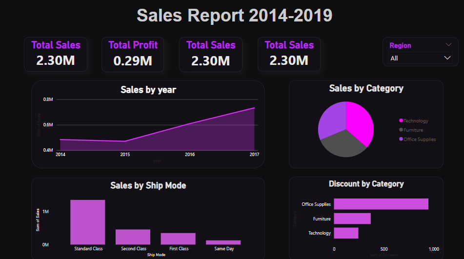

# 🛒 SuperMarket Sales Analysis

## 📌 Project Overview

This project focuses on analyzing the Super Market data to uncover sales and profit trends across different regions, categories, and customer segments. The goal is to extract meaningful business insights using **Python (EDA)** and build an interactive **Power BI dashboard** for visualization.

---

## 🧰 Tools & Technologies Used

- **Python** (Pandas, Matplotlib, Seaborn)
- **Power BI**
- **Google Colab**
- **CSV Dataset**

---

## 📁 Files Included

| File | Description |
|------|-------------|
| `Superstore_Data.csv` | Dataset used for analysis |
| `EDA.ipynb` | Python notebook with exploratory data analysis |
| `dashboard.pbix` | Power BI dashboard file |
| `images/` | Screenshots of visuals from the dashboard |
| `insights.md` | Summary of key insights |
| `README.md` | Project documentation (this file) |

---

## 📊 Dashboard Visuals

- 📈 Yearly Growth in Profit (Line Chart)
- 🥧 Sales by Product Category (Pie Chart)
- 📦 Sales by Shipping Mode (Column Chart)
- 🌍 Sales by State (Map Chart)
- 🧾 Discount vs Profit (Heatmap)
- 🔟 Top 10 Profitable Products (Bar Chart)
- 📌 KPI Tiles (Total Sales, Total Profit, Total Orders, Total Customers)

  

---

## 📊 Sample Insights

- The **West** region generates the most sales but isn't always the most profitable.
- **High discounts** on certain sub-categories reduce overall profitability.
- **Standard Class** shipping is most used but may impact delivery times and cost.
- **Top 10 products** contribute significantly to total profit – valuable for marketing focus.

---

---

## 🧠 Author

- [Sujal Vishwakarma](https://github.com/Sujal-Git)

---

## 📜 License

This project is licensed under the MIT License.
